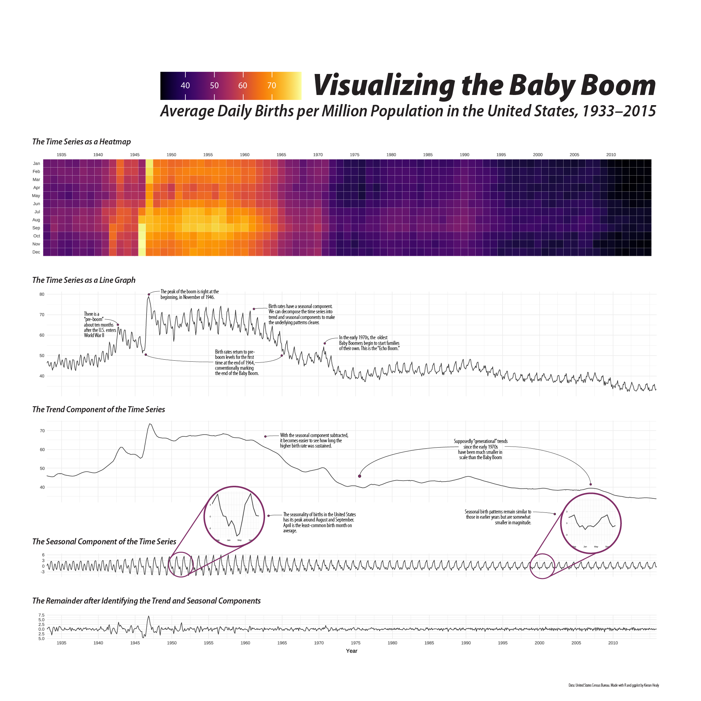

Manhattan's building footprints and heights above ground level. Data from New York City's OpenData initiative. 

Available as a print in a variety of sizes. Looks best in large sizes. The version shown here is highly compressed in order to not take all day loading on the page. The actual image is substantially sharper, as shown in this detail. 

